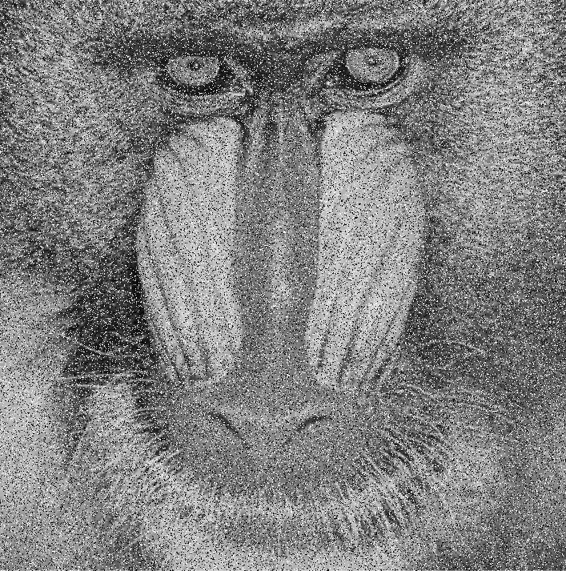
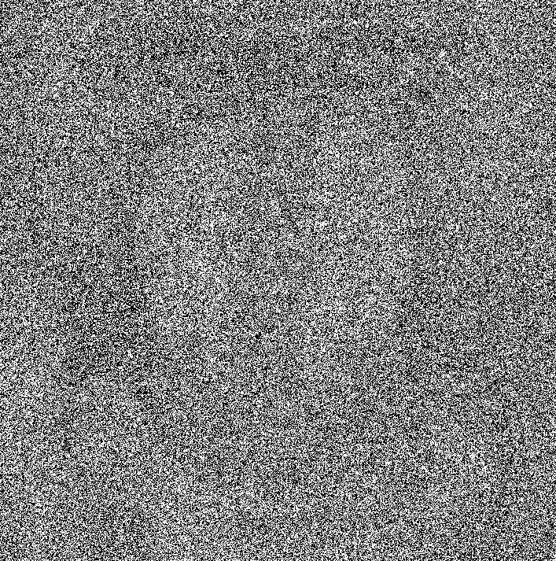

# FuzzyFilter
In this project I implemented a type 2 adaptive fuzzy filter to filter salt &amp; pepper (SAP) noise from images. 

This project follows the steps described in the following paper for the implementation: https://arxiv.org/pdf/2008.04114.pdf

## Introduction

This project aims to implement a type 2 adaptive fuzzy filter to filter salt & pepper (SAP) noise from images. To remove noise, a fuzzy logic filter with an adaptive threshold and two different membership functions is used in the first step to categorize good pixels and noisy pixels in an image window. Then, noisy pixels are removed from the noise using the usual fuzzy logic in that window. The final result will depend on the noise level in the original image, the higher the noise level, the lower the quality of the filtered image, but the key features of the original (noise-free) image will be largely preserved.
The presence of noise in an image can be a detriment to image processing methods as it can deteriorate image quality. It can affect operations such as image segmentation, edge detection or object recognition. So removing noise from an image is an important image pre-processing step to achieve good image processing results.

## Implementation

In order to obtain results that can be measured both qualitatively and quantitatively, we first start with a noise-free image. In the Pepperify.m file we can change the percentage of the image that will be replaced by noise. After running this script a new image will be generated, this image will then be used to remove the noise.
In the deNoise.m file is the code for noise removal. The implementation of the algorithm is as follows:

Pixel clasification:
  1. For each pixel in the image that has a value of 0 or 1 (i.e. salt and paper noise) an initial window of radius 1 is set around the pixel (i.e. 9 pixels in total). If such a window cannot be generated because the pixel is too close to the edge of the image, then that pixel is ignored.
  
  2. For each generated window 3 values are set, the average of the pixels above the central pixel (m1), the average of the pixels below the central pixel (m2) and the variation of the pixels in the image (v).
  
  3. Using the values determined in step 2) the values of the Gaussian membership functions are calculated for each pixel in the window, one for each average (m1 and m2). These values will be used to determine if a pixel has a similar value to the other pixels in the window.
  
  4. The values calculated above are distributed into a vector for the upper membership function values and a vector for the lower membership function values.
  5. Using the above values the lower and upper thresholds for the window will be calculated

  6. By comparing the arithmetic mean of the upper/lower membership function values with a threshold that lies between the lower and upper threshold we can decide which pixels are good and which pixels are noisy. If there are too few good pixels in the window, then the window radius increases by 1 and we go back to step 1).

Noise elimination:

  7. For the good pixels, their mean and variance are calculated, and the new value of the center pixel will be calculated according to these two values.
  

## Results

### Qualitative results

**Original Image**

**Image with 20% noise**

**Image with 20% noise after the method is applied**

**Image with 80% noise**

**Image with 80% noise after the method is applied**

### Quantitative results

For the quantitative results, the signal-to-noise ratio between the original and filtered images was calculated.

| Dataset  | Results described in paper | Own results |
| ------------- | ------------- | ------------- |
| Baboon with 20% noise  | 29.38  | 29.363 |
| Baboon with 50% noise   | 24.65  | 25.091 |
| Baboon with 80% noise   | 20.85  | 21.591 |

## Conclusions

The Type 2 adaptive fuzzy filter for filtering salt and pepper noise from images brings improvements in filtering images from SAP noise, especially for high noise images. The qualitative results are impressive, as this filtering method manages to preserve key features of the original image, making it a useful image pre-processing method if we want to recognise objects, identify edges of objects in the image or if we want to segment the image. Combined with other image quality enhancement techniques (using artificial intelligence, for example), this method can help in reconstructing the original image at a high quality level. 

